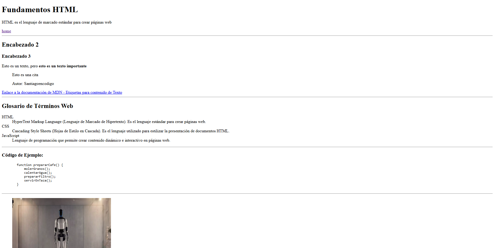

# Fundamentos HTML

* [Codigo HTML con Apuntes (comentarios)](https://github.com/santiagoencodigo/desarrollo-web-profesional/blob/main/pages/01-html/index.html)

* [Codigo HTML maquetación profesional de portfolio web](https://github.com/santiagoencodigo/desarrollo-web-profesional/blob/main/pages/01-html/maquetacion_profesional.html)

* [Proyecto](https://santiagoencodigo.github.io/desarrollo-web-profesional/pages/01-html/index.html)

> Estos son mis apuntes personales de aprendizaje sobre el desarrollo web, el contenido está basado en mi estudio y práctica por lo que irá evolucionando a traves del tiempo.

HTML es el lenguaje que da forma a la web. En esta sección se encuentra la información sobre cómo crear estructuras claras y semánticas, aprendiendo a escribir código ordenado y funcional. En esta lectura tambien se entenderá por qué una buena organización en HTML mejora la accesibilidad, el SEO y mantenibilidad de cualquier sitio.

>HTML: (HyperText Markup Language) es el lenguaje que define la estructura básica de todas las páginas web. Funciona mediante etiquetas (tags) que organizan el contenido como texto, imagenes, enlaces y más elementos para que el navegador pueda mostrarlos correctamente.

>SEO: (Search Engine Optimization) es el conjunto de prácticas que ayudan a que una página web sea más visible en los motores de búsqueda como Google

---

## Tabla de Contenido

1. [Maquetación web con HTML semántico y accesible](#maquetación-web-con-html-semántico-y-accesible)
2. [Cómo funciona la web desde la URL hasta la página renderizada](#cómo-funciona-la-web-desde-la-url-hasta-la-página-renderizada)
3. [Tipos de inputs HTML para formularios avanzados](#tipos-de-inputs-html-para-formularios-avanzados)
4. [Desarrollo Web Profesional: Accesibilidad, Semántica y Optimización SEO](#desarrollo-web-profesional-accesibilidad-semántica-y-optimización-seo)
5. [Conclusión](#conclusión)

<!-- Start the Learning Path -->
--- 

## Maquetación web con HTML semántico y accesible

Me interesa bastante la capacidad de construir páginas web por lo que el primer paso es aprender a maquetar en HTML, uno de los 3 lenguajes que tiene el navegador (HTML, CSS, JS) por lo que vamos a ir viendo maquetación semántica, accesible y con buenas prácticas para SEO.

Maquetar en HTML consiste en construir la estructura visual y lógica de una página web usando etiquetas. Es el proceso de transformar un diseño o una idea en una base organizada que el navegador pueda interpretar correctamente.

>Profesor: Diego De Granda

*Imagen tomada de: https://www.seas.es/blog/informatica/la-primera-web-de-la-historia/*

>Primera Página Web en el mundo realizada en HTML por Tim Berners Lee: https://info.cern.ch/hypertext/WWW/TheProject.html

---

## Cómo funciona la web desde la URL hasta la página renderizada

Como reflexión inicial hay unas preguntas interesantes: ¿Cómo funciona HTML en el navegador?, ¿Qué es lo que sucede cuando busco una dirección en Google y oprimo la tecla enter?, ¿Cómo el navegador interpreta el código HTML que voy a escribir?

---

**¿Qué es Internet y cómo funciona?**

Cuando utilizamos un navegador y queremos mirar o utilizar ciertas páginas web, lo que sucede por detras es un **[HTTP REQUEST](https://www.ibm.com/docs/es/concert/2.0.0?topic=common-http-request "Definición e información técnica HTTP REQUEST by IBM")** que por medio de internet (Red de redes interconectadas) llegan a los servidores (Computadora que almacena sitios) para poder buscar la URL que nosotros queremos ver, el servidor la va a encontrar y la regresa la información en una respuesta de HTML al cliente (Nuestro navegador) mostrando asi el proyecto o página que se estaba buscando.

Un ejemplo claro puede ser: Si vas a ingresar a https://santiagoencodigo.github.io/Desarrollo-Web-Profesional/index.html o a cualquier pagina por medio de tu navegador, se realiza una HTTP REQUEST la cual le va a solicitar a unos servidores la información, por lo que se encontrará un paquete de archivos que serán enviados por medio de una HTTP RESPONSE y tu navegador los va a interpretar mostrandote mi proyecto.

*Imagen Tomada de: https://medium.com/@amalpp42/http-request-response-d91dcadf7fb1*

>Concepto Clave: Internet es la infraestructura física (cables, routers, servidores), mientras que la web (World Wide Web) es el sistema de información que funciona sobre internet usando protocolo HTTP.

---

**¿Qué sucede cuando escribes una URL**

Cuando escribes una dirección web como www.ejemplo.com en tu navegador, ocurre un proceso complejo en milisegundos.

Se le conoce como **El proceso DNS (Domain Name System)** en donde primero, el navegador necesita encontrar la dirección IP del servidor: 

1. Solicitas www.ejemplo.com
2. DNS traduce del nombre (Dominio) a la IP
3. Se obtiene la dirección IP
4. Se conecta al cliente con el servidor

>Lectura Recomendada: https://github.com/santiagoencodigo/Desarrollo-Web-Profesional/blob/main/Docs/1.%20Introducci%C3%B3n%20a%20la%20Web%20Historia%20y%20Funcionamiento%20de%20Internet.md

---

**Los tres lenguajes fundamentales de la Web**

Todo sitio web está construido con estos tres lenguajes que el navegador puede entender:

1. HTML: HyperText Markup Language define la estructura y el contenido como el texto, títulos, imágenes, enlaces y botones.

2. CSS: Cascading Stylesheet nos permite controlar la presentación visual como los colores, tipografía, espacios y tamaños.

3. Javascript: Es un lenguaje de programación para que podamos tener una interacción con la página, como respuesta a clicks, animaciones, validación de formularios y contenido dinámico.

*Imagen Tomada de: https://www.cursosgis.com/como-integramos-los-lenguajes-html-css-y-javascript/*

---

**¿Cómo el navegador muestra y lee una página web?**

Tiene un proceso de renderizado en el cual:

1. Descarga el HTML: el navegador recibe le archivo HTML principal del servidor

2. Analiza el HTML: Lee el HTML de arriba hacia abajo, creando el DOM (Document Object Model)

3. Encuentra recursos externos: Identifica referencias CSS, javascript, imágenes, y otros archivos.

4. Descarga CSS y aplica estilos: Descarga los archivos CSS y construye el CSSOM (CSS Object Model) 

5. Ejecuta Javascript: Descarga y ejecuta el código Javascript que puede modificar el contenido.

6. Renderiza la página: Combina todo y muestra la página final al usuario.

---

**Tipos de páginas**

Existen dos tipos de página:

1. **Páginas web estáticas**: El contenido no cambia por lo que generalmente tienen HTML y CSS, puede que un poco de Javascript básico o incluso no tenerlo.   Generalmente son para lecturas, tambien se les conoce como paginas de consumo, el contenido es el mismo para todos los usuarios, no requiere bases de datos, son muy rápidas para cargar y son ideales para sitios informativos.   Ejemplos: Sitios Corporativos, portfolios, blogs, simples, landings pages. 

2. **Páginas web dinámicas**: Tambien las podemos conocer como aplicaciones web como youtube.com, canva.com, platzi.com, facebook.com, y muchas más. El contenido cambia según el usuario, por lo que es contenido personalizado.   Requiere programación del servidor y usa una base de datos, tiene mayor interactividad.   Ejemplo: Cuando tu ingresas a youtube puedes mirar videos, navegar entre videos, dejar interacciones como likes, suscripciones, comentarios, generar usuario y demás cosas. *Como caracteristica interesante los perfiles quedan totalmente personalizados.*

---

**Las dos caras del desarrollo**

El desarrollo se divide en dos áreas principales:

1. Frontend: Es el lado del cliente, todo lo que el usuario ve e interactúa directamente, se ejecuta en el navegador web y para hacer esto, necesitamos HTML, CSS, Javascript y se puede usar react, vue, angular.

2. Backend: El lado del servidor, "Todo lo que pasa por detras" por lo que es la lógica, bases de datos y todos los procesos en el servidor que el usuario no ve este código directamente, para hacer esto podemos usar PHP, python, Node.js, Java, MySQL, MongoDB.

---

**Herramientas que se van a utilizar**

Para desarrollar una página web, necesitamos dos herramientas básicas:

1. Editor de texto: Donde escribiremos el código como por ejemplo VISUAL STUDIO CODE, Cursor, etc...

2. Navegador: Donde veremos la página como por ejemplo CHROME, BRAVE, OPERA, etc...

Video recomendado: https://www.youtube.com/watch?v=bN6DE-4uFNo

---

## Tipos de inputs HTML para formularios avanzados

---

## Desarrollo Web Profesional: Accesibilidad, Semántica y Optimización SEO

Aprender sobre los atributos ARIA permite mejorar la accesibilidad web, facilitando la navegación mediante lectores de pantalla. A su vez, la estructura semántica en HTML y el uso correcto de meta tags contribuyen a un mejor posicionamiento (SEO) y comprensión del contenido por parte de los navegadores y buscadores. Finalmente, la integración de estos conocimientos se aplica en la construcción de un portafolio profesional, combinando semántica, diseño y buenas prácticas de desarrollo para lograr proyectos web completos, funcionales y bien optimizados.

>Proximamente lo voy a estudiar.

---

## Conclusión

Este documento resume las bases y principios del desarrollo web utilizando HTML, desde la maquetación semántica hasta los conceptos avanzados de accesibilidad y optimización SEO. A lo largo de los temas, se abordaron las estructuras más importantes que conforman una página web, el funcionamiento interno de la web, los tipos de formularios y la importancia de construir proyectos con buenas prácticas profesionales.

Para consultar ejemplos de código, estructuras, etiquetas y elementos HTML desarrollados durante el estudio, visita el siguiente enlace del repositorio:

https://github.com/santiagoencodigo/desarrollo-web-profesional/tree/main/projects/fundamentos-html/index.html

> Gracias por leer.