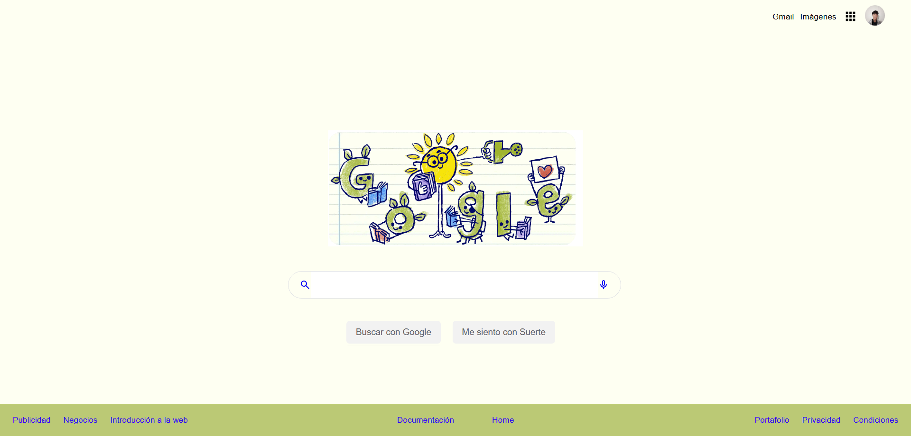

<!-- Inicio del README HTML y CSS - Clon Google -->

<h1 id ="Clon-Google-Title" style="text-align:center;">Curso Práctico de HTML y CSS</h1>

* [Proyecto](https://santiagoencodigo.github.io/desarrollo-web-profesional/pages/02-google-clone/index.html "Clon de Google By Santiagoencodigo")

* [Readme Principal](https://github.com/santiagoencodigo/desarrollo-web-profesional "Repo Desarrollo Web")

<!-- INTRODUCCION -->

>Construye un clon de Google usando HTML y CSS. Aprende a estructurar y estilizar un sitio web completo, desde el header hasta el footer, usando técnicas de maquetación como Flexbox y Grid. Ideal para afianzar fundamentos.

>Profesor: [Diego De Granda](https://x.com/degranda10?lang=es "X Profile Diego De Granda")

### ¿Por qué aprendes lo que aprendes?

Ten claridad de qué quieres programar, primero es importante plantear lo que quieres hacer para escojer qué aprender sobre qué tecnologías se utilizan para hacer realidad esa idea.
 
* ¿Qué Quieres Programar?
* ¿Qué Quieres Lograr Con Tu Programa?

Voy a aprender HTML, CSS y JavaScript ya que el Desarrollo Web es hoy en día uno de los campos con mayor demanda y crecimiento, los navegadores me permiten llevar aplicaciones web a móviles, tablets y computadores. **Dandome la posibilidad de crear elementos de forma global.**

> Lectura Recomendada: <https://platzi.com/blog/como-aprender-a-programar/>

---

<!-- Contrucción -->

## Construcción de un Clon Web con HTML y CSS

El objetivo en este Aprendizaje es realizar un [clon de la pagina principal de Google](https://www.google.com/ "main page google") llevando a practica conocimientos en HTML y CSS.

**Herramientas Utilizadas**

* Editor de texto: [Visual Studio Code](https://visualstudio.microsoft.com/es/ "Page Visual Studio Code")

* Navegador: (Yo personalmente utilizo [Brave](https://brave.com/es/ "Page Brave.com"))

---

<!-- Definición HTML -->

HTML5 (HyperText Markup Language): Es el lenguaje estándar para estructurar el contenido de un sitio web. Su funcionamiento se basa en etiquetas que definen los diferentes elementos de la página.

    <html> <a> 
 
 <footer> <heeader> <button>

>[Selector = Etiqueta HTML](https://static.platzi.com/media/articlases/Images/image%2833%29.png "Imagen explicación HTML etiquetas")

<!-- Definición CSS -->

CSS3 (Cascading Style Sheets): Es el lenguaje que permite aplicar estilos y diseño a los elementos definidos en un documento HTML. Su sintaxis se compone de selectores, propiedades y valores:

* Selector → Identifica el elemento HTML al que se aplicará el estilo.

* Propiedad → Define el aspecto a modificar (ejemplo: color, margin, padding).

* Valor → Especifica cómo se aplicará la propiedad (ejemplo: 10px, 1rem, auto, black).

>[Selección + Propiedad y Valor = Declaracion](https://static.platzi.com/media/articlases/Images/image%2834%29.png "Imagen explicación CSS elements")

Y a todo esto en conjunto le llamamos reglas pues en CSS, una regla es el bloque completo que define cómo se debe mostrar un elemento HTML en la página.

>Documentación sobre HTML, CSS y JS: [https://developer.mozilla.org/en-US/](https://developer.mozilla.org/en-US/ "WebSite: HTML, CSS, JS documents")

### WebSites Recomendados:

* Guía para entender las propiedades de CSS son ejemplos animados: [https://cssreference.io/](https://cssreference.io/ "WebSite: css ")

* Guía completa de Flexbox: [https://css-tricks.com/snippets/css/a-guide-to-flexbox/](https://css-tricks.com/snippets/css/a-guide-to-flexbox/ "WebSite: css tricks ")

* Aprende HTML con ejercicios: [https://www.w3schools.com/html/default.asp](https://www.w3schools.com/html/default.asp "WebSite: w3school")

* Aprende sobre Flexbox jugando: [https://flexboxfroggy.com/#es](https://flexboxfroggy.com/#es "WebSite: FlexBox Froggy")

---

<!-- ANALISIS -->

<h2 id="title-maquetacion">Maquetación HTML5: Clon de Página Web</h2>

Al visitar [google.com](https://www.google.com "www.google.com") **¿Qué elementos vemos?**

  

HTML Semántico: nos permite identificar donde estamos trabajando por medio de sus etiquetas.
 
    Header: Representa la cabecera de la página e incluye una barra de navegación con enlaces   <a>. En Google, esta sección contiene accesos a productos y servicios.

    Body: Encontramos la sección principal con 1. Logotipo de Google , 2. La Barra de Busqueda <input>, 3. Los botones de interacción (por ejemplo, “Buscar con Google” y “Voy a tener suerte”). <button>

    Footer: Ubicado al final de la página, contiene enlaces adicionales agrupados en dos bloques de navegación (<nav>), uno alineado a la izquierda y otro a la derecha. Estos proporcionan accesos a configuraciones, políticas y otros recursos.

>Del usuario Javier Eduardo Morón Mendoza encontre una [versión diferente](https://static.platzi.com/media/user_upload/Challenge-b1a4f5b6-3ce1-4adb-af2a-932bf7aa6880.jpg "Clon 'Platzi' version google") de lo que vamos a realizar en este proyecto, me pareció muy interesante.

>Si realizamos sólo la estructura del HTML podemos tener estas [vistas](https://static.platzi.com/media/user_upload/FireShot%20Capture%20006%20-%20Google%20-%20-95144eb0-9cfe-46b9-ab74-293634734cb2.jpg "Vistas HTML")

---

<!-- SETUP -->

## Organización de Archivos y Carpetas en Proyectos Web  --> Configuración del proyecto

En este apartado vamos a realizar el Setup del proyecto que es cómo vamos a organizar nuestras carpetas y archivos de nuestro proyecto, como por ejemplo:

>Carpeta ASSETS: que es el espacio donde generalmente dejamos imagenes, fuentes, iconos

Por lo que de acuerdo a lo que vimos la anterior <a href="#title-maquetacion">maquetación</a>

### Necesitamos:
* Archivo HTML: index.html - Necesitamos que nuestro clon de google tenga una estructura de imagen, input, enlaces etc... 

* Archivo CSS: main.css - El clon requiere de unos estilos para posicionar esos elementos en HTML

* Carpeta Assets: css - Es la carpeta donde vamos a guardar la imagen o el icono de google

>Un shortcut: es una Abreviación que nos permite generar un grupo de código. Es agrupar con un simbolo un grupo de ciertas lineas de codigo como utilizar el signo " ! " en un archivo HTML al estar este sin ninguna linea de codigo y al oprimir la tecla *tabulador* ya tendremos una estructura del HTML

### Repaso de etiquetas:

    <!DOCTYPE html>:Esta etiqueta sirve para avisar al navegador que estamos hablando de HTML5.

    <Head>:Es una etiqueta contenedora, y no es visible para el usuario, pero es necesaria para manejar dependencias.

    <Body>:Es una etiqueta contenedora, y contiene todo lo visual con lo que el usuario puede interactuar.

    <Link>:Es una etiqueta de contenido que sirve para referenciar ciertos assets y por medio de esta invocaremos nuestro archivo css.

<!-- DEV TOOLS -->

## Uso de Herramientas de Desarrollo en Navegadores para Depuración y CSS en Tiempo Real

Estas son una serie de herramientas que nos permite el navegador, las DEV TOOLS se encuentran en cualquier navegador que se pueda utilizar. Nos ayuda a mejorar nuetro proceso de desarrollo, nos permite ver como el navegador interpreta y maneja nuestro codigo, por lo que nos permite debuggear/depurar a tiempo real.

Nos permite ver el comportamiento de nuestro código para depurarlo y poder implementar mejoras.

>Pluggins: Los navegadores permiten ampliar sus funcionalidades mediante plugins o extensiones. Estas herramientas complementarias facilitan el flujo de trabajo del desarrollador, ya que ofrecen utilidades para inspeccionar código, optimizar CSS y JavaScript, analizar rendimiento, o incluso automatizar tareas repetitivas.
Al integrarlos con las DevTools, los plugins se convierten en un apoyo clave para mejorar la productividad y la calidad del desarrollo en tiempo real.

Las DevTools permiten realizar modificaciones directamente sobre el código de una página y visualizar los cambios en tiempo real. Esto resulta útil para ajustar estilos, depurar errores y probar configuraciones antes de implementarlas de forma definitiva en el proyecto.

Para acceder a estas herramientas existen varias opciones:

1. Haz clic derecho en cualquier parte vacía de la página y selecciona “Inspeccionar”.
2. Usa el atajo de teclado Ctrl + Shift + I.

Una vez abiertas las Dev Tools nos encontramos con varias pestañas y opciones. Nosotros nos centraremos en la pestaña elementos para visualizar y modificar nuestro proyecto.

* Elements: Permite inspeccionar la estructura HTML y los estilos CSS aplicados a cada elemento de la página. Desde aquí podemos modificar el código en tiempo real, probar nuevos estilos, añadir o eliminar etiquetas, y observar inmediatamente los cambios en la interfaz.

* Console: Es un entorno interactivo donde se muestran mensajes del navegador (como errores, advertencias o logs). También nos permite ejecutar código JavaScript en tiempo real, probar funciones y depurar el comportamiento de nuestra aplicación paso a paso.

Si quieres conocer más sobre las Dev Tools, te dejo la documentación de la página oficial de Google: [https://developer.chrome.com/docs/devtools?hl=es-419](https://developer.chrome.com/docs/devtools?hl=es-419 "Documentación DEVTOOLS from Google")

---

<!-- MAQUETACION SEMÁNTICA HTML -->

## Maquetación Semántica HTML5: Estructura y Navegación Básica

[Etiquetas](https://static.platzi.com/media/articlases/Images/6%281%29.png "Imagen etiquetas"): Al crear una página web necesitamos usar etiquetas HTML que nos permiten dar estructura y definir cómo se comporta el contenido. Algunos ejemplos importantes:

> Se utiliza para especificar los caracteres que tendrá el sitio 

    <meta charset="UTF-8">: especifica la codificación de caracteres, en este caso UTF-8, que permite mostrar correctamente símbolos, acentos y caracteres especiales.

    <meta name="viewport" content="width=device-width, initial-scale=1.0">: Este meta esta dividido en tres partes:

    1. <meta> es el elemento de ventana gráfica en todas las páginas web
    
    2. width=device-width: ajusta el ancho de la página al ancho de la pantalla del dispositivo.

    3. initial-scale=1.0: establece el nivel de zoom inicial cuando se carga la página

Header: representa la cabecera del sitio, donde normalmente se colocan logotipos, menús o títulos principales.

Nav: define la sección de navegación, es decir, los enlaces que nos llevan a distintas partes del sitio.

Ul: crea una lista desordenada.

Li: representa cada ítem dentro de esa lista.

<!-- Definición Live Server -->

>[Live Server: ](https://static.platzi.com/media/articlases/Images/image%2840%29.png "Imagen Extensión Live Server"): Es una extensión de Visual Studio Code que levanta un servidor local para tu proyecto y recarga automáticamente la página cada vez que guardas cambios. Es súper útil porque te permite ver el resultado en tiempo real sin tener que actualizar manualmente el navegador.

<!-- Definición Visual Studio Code -->

>Visual Studio Code (VS Code) es un editor de código ligero pero muy potente, desarrollado por Microsoft. Tiene soporte para múltiples lenguajes, integración con Git y una enorme librería de extensiones que mejoran el flujo de trabajo del desarrollador.

>Guía rápida de configuración: [Configuración VSCODE](https://www.youtube.com/watch?v=o8iqG4bAN0s&t "Configuración VS STUDIO")

---

<!-- Estilos CSS -->

## Estilos CSS para Clonar el Header de una Página Web

HTML5 tiene dos tipos de etiquetas, una contenedora, etiquetas de caja (padre) y etiquetas de contenido (hijo) diferenciandose estas dos siendo una que es el contenido que va a ver el usuario y otra la que contiene este contenido (Texto, imagenes, videos) como por ejemplo:

    

        

    

**Etiquetas Contenedoras**: Son las que agrupan y organizan otros elementos dentro de la página.

* [header](https://static.platzi.com/media/articlases/Images/7.2.png "Imagen Header CSS"): define la cabecera de una página o sección; normalmente contiene logotipos, menús de navegación o títulos principales.

* [nav](https://static.platzi.com/media/articlases/Images/7.3.png "Imagen Header Nav CSS"): indica una sección de navegación con enlaces que permiten moverse por el sitio o hacia páginas externas.

* section: representa una sección temática del documento; se usa para agrupar contenido relacionado dentro de la página.

* div: es un contenedor genérico sin significado semántico; se utiliza principalmente para organizar bloques de contenido y aplicarles estilos con CSS.

**Etiquetas de Contenido**:

* p: define un párrafo de texto.

* a: crea un enlace (hipervínculo) a otra página, sección o recurso.

* li: representa un elemento dentro de una lista (ul o ol).

* h1: título principal de la página o sección; tiene la mayor jerarquía dentro de los encabezados (h1 a h6).

* img: inserta una imagen en el documento; requiere el atributo src (fuente) y puede incluir alt (texto alternativo).

---

<!-- LAYOUTS -->

Si tenemos muy buena estructura de HTML, será muy facil agregarle estilos a los elementos, que sea semántico es muy importante ya que asi el contenido se organiza sólo.

En este proyecto vamos a manejar tres tipos de layout (display) que define cómo se van a comportar las etiquetas contenedoras dentro de estos layouts, por lo que nos ayuda a posicionar mejor su contenido: *estos salen para solucionar el problema de posicionamiento de elementos*

1. Display Layout: Es el original que salió con CSS1. El elemento expone su contenido utilizando el diseño de flujo (diseño en bloque y en línea).

2. Display Flex: El elemento se comporta como un elemento de bloque y establece su contenido de acuerdo con el modelo de cuadrícula.

3. Display Grid: El elemento se comporta como un elemento de bloque y establece su contenido de acuerdo con el modelo de flexbox

---

<!-- Definción BEM -->

## Metodologia BEM

BEM significa Block, Element, Modifier y es una metodología de nomenclatura para clases en CSS que busca escribir código más claro, mantenible y escalable.

>Block (Bloque): un componente independiente que tiene sentido por sí mismo (ejemplo: menu, button, header).

>Element (Elemento): parte de un bloque que cumple una función específica y depende de él (ejemplo: menu__item, button__icon).

>Modifier (Modificador): una variación o estado del bloque o elemento (ejemplo: button--primary, menu__item--active).

En HTML y CSS utilizamos clases e IDs para aplicar estilos:

* Class: es un identificador que se asigna a una etiqueta HTML para aplicar estilos desde CSS. Las clases son reutilizables, lo que significa que pueden aplicarse a varios elementos que compartan la misma apariencia o comportamiento.

* ID: es un identificador único que solo debe aplicarse a un elemento dentro del documento. Sirve para casos puntuales donde se requiere un estilo o referencia exclusiva.

lectura recomandada: [https://getbem.com/introduction/](https://getbem.com/introduction/ "WebSite:  BEM")

---

<!-- Imagenes -->

## Uso de Iconos e Imágenes en Navegación con HTML y CSS

Cuando trabajamos con iconos o imágenes en una barra de navegación, es común que las URLs de los recursos sean demasiado largas y no se visualicen completas en el editor.

World Wrap: probablemente la URL sea demasiado larga para que la veas completa en la pantalla de tu editor. Para evitar ese molesto scroll, ve a la pestaña View de tu editor y activa la función Word Wrap.

### WebSites recomendados para iconos:

Existen varios sitios donde se puede encontrar iconos gratuitos y personalizables para proyectos:

* https://fonts.google.com/icons

* https://www.flaticon.es/

+ https://fontawesome.com/icons?d=gallery

+ https://iconos8.es/

--- 

<!-- Maquetación -->

## Maquetación HTML de un Clon de Google Paso a Paso

[Estructura MAIN](https://static.platzi.com/media/articlases/Images/image%2856%29.png "Imagen Main Section Google")

**El main se divide en tres partes principales:**

1. Logo (main-logo): un img que muestra el logotipo de Google.

2. Buscador (main-input): un contenedor que incluye:

>* Un span con la clase search-icon para mostrar el ícono de la lupa.

>* Un input donde el usuario escribe su búsqueda.

>* Un a con la clase micro-icon que representa el micrófono para búsquedas por voz.

3. Botones (main-buttons): un contenedor con dos button, uno para “Buscar con Google” y otro para “Voy a tener suerte”.

---

<!-- Estilos CSS Logos - Content -->

## Estilos CSS para Posicionar Logos y Contenido en HTML

Al trabajar con Flexbox y Grid, el proceso de maquetación se vuelve mucho más rápido y eficiente. Estas propiedades nos permiten alinear y distribuir elementos en pantalla con muy pocas líneas de código, evitando tener que usar soluciones más complicadas como position o cálculos manuales con márgenes. En pocas palabras, ahorramos tiempo y esfuerzo al resolver el diseño de forma más limpia y flexible.

Uno de los retos al desarrollar este clon fue el logo de Google. En lugar de descargar una versión estática, decidí usar el recurso oficial disponible en [https://doodles.google/](https://doodles.google/ "Doodles Google") ya que allí se pueden encontrar variaciones del logo en alta calidad y siempre actualizadas.

<!-- CSS BORDES -->

### Estilos de Bordes.

La border-style es una propiedad especifica qué tipo de borde mostrar.

Se permiten los siguientes valores:

* dotted - Define un borde punteado
* dashed - Define un borde punteado
* solid - Define un borde sólido
* double - Define un doble borde
* groove- Define un borde acanalado en 3D. El efecto depende del valor del color del borde.
* ridge- Define un borde ondulado en 3D. El efecto depende del valor del color del borde.
* inset- Define un borde insertado en 3D. El efecto depende del valor del color del borde.
* outset- Define un borde de inicio 3D. El efecto depende del valor del color del borde.
* none - Define sin borde
* hidden - Define un borde oculto

## Efecto Hover y Sombra en Inputs con CSS

Podemos aplicar estilos dinámicos a los inputs usando el pseudo-elemento **:hover** - Esto significa que los cambios visuales, como resaltar el borde o agregar una sombra, solo se mostrarán cuando el usuario pase el cursor por encima del campo de entrada, mejorando así la interactividad y la experiencia de uso.

---

<!-- Instrucciones CSS para añadir diseño a un btn -->

### [**Pasos para darle diseño de caja a los botones**](https://static.platzi.com/media/articlases/Images/14.3.png "Imagen codigo")

1. Llamamos la clase que contiene los botones que contenga la etiqueta button con main .main-buttons button.
2. Le damos una altura con height: 36px.
3. Ajustamos el color de fondo con background-color: #f2f2f2.
4. Cambiamos el borde para que no se desplaze al colocar el cursor encima con border: 1px. solid #f2f2f2.
5. Cambiamos el tamaño de fuente con font-size: 14px.
6. Cambiamos el color de la fuente con color: #5f6368.
7. Redondeamos los bordes con border-radius: 5px.
8. Añadimos espacio interno a los lados con padding: 0 15px.
9. Añadimos una separación entre los botones con margin-right: 15px.

<!-- CSS - Footer -->

## Estilos CSS para posicionamiento y diseño de contenedores en HTML

Con CSS Grid, introducido en CSS3, podemos organizar elementos en una cuadrícula flexible que se divide en filas y columnas. Esto nos permite distribuir el espacio en fracciones programables y lograr un diseño mucho más ordenado con menos código.

### Diferencias de Flex y Grid

Aunque a veces se comparan, Flexbox y Grid no compiten, se complementan:

+ Grid es ideal para definir estructuras completas en dos dimensiones (filas y columnas). En este proyecto, por ejemplo, lo usamos en el footer, ya que necesitábamos tres secciones distribuidas de forma clara.

+ Flexbox funciona mejor en una sola dimensión (fila o columna) y se utiliza para organizar el contenido dentro de un contenedor padre.

Gracias a estas técnicas, podemos darle un diseño visual consistente y flexible a [la estructura HTML](https://static.platzi.com/media/articlases/Images/image%2884%29.png "Imagen HTML Footer") 

Lectura Recomendada: [Qué sigue despues de HTML y CSS](https://platzi.com/blog/despues-aprender-html-css/ "Articulo from Platzi")

><a href="#Clon-Google-Title">Click aqui para volver a encabezado de este texto</a>