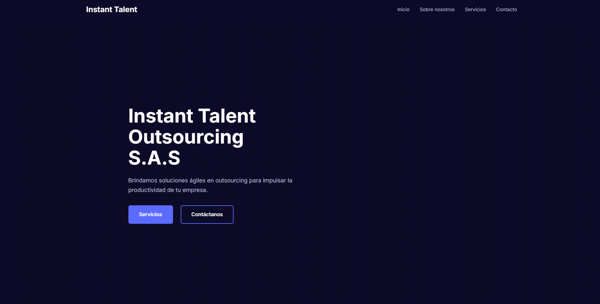
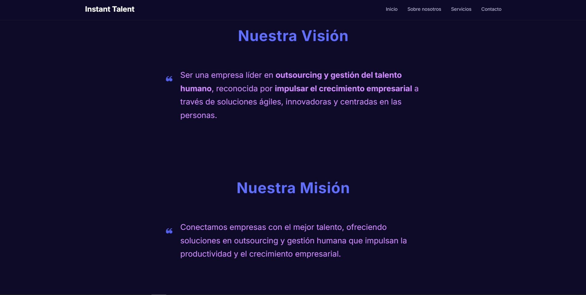
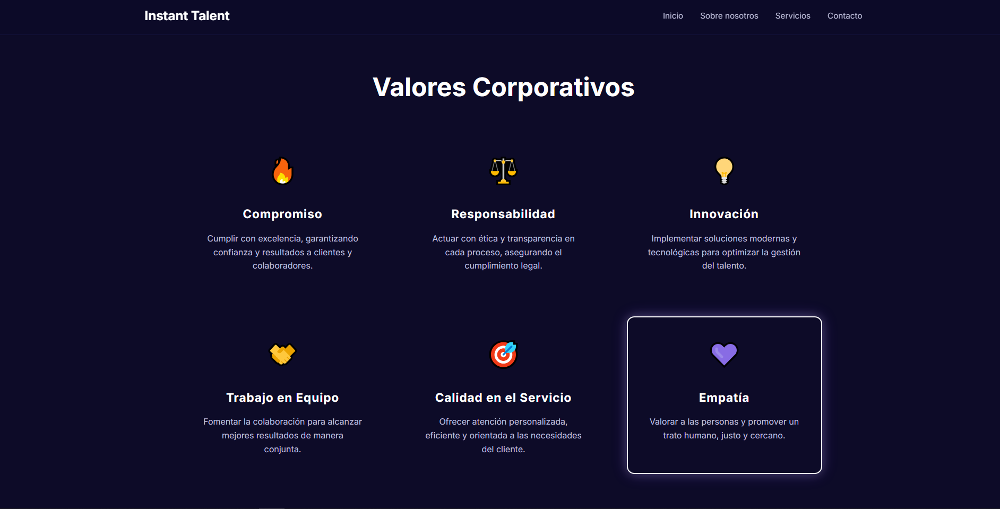
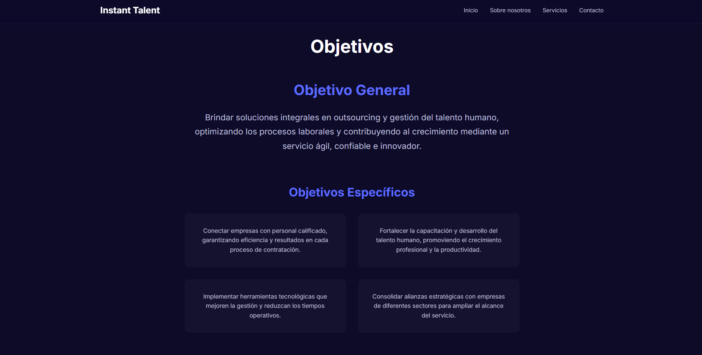
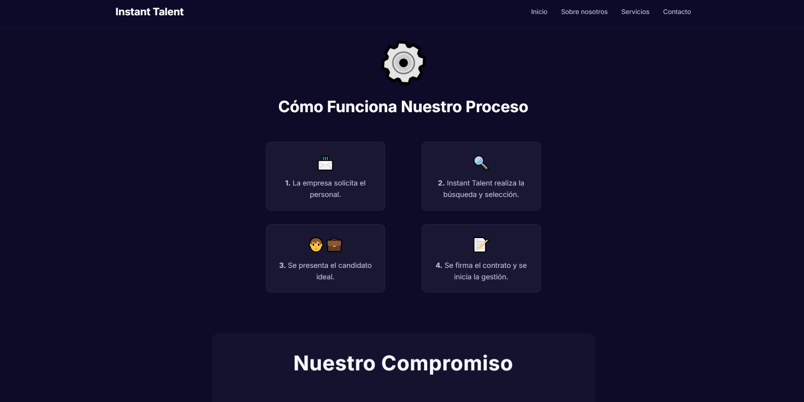
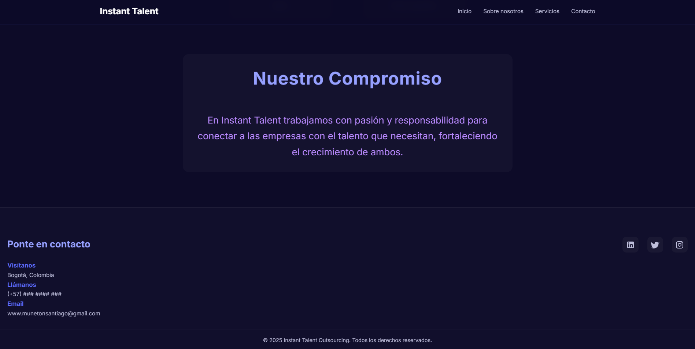
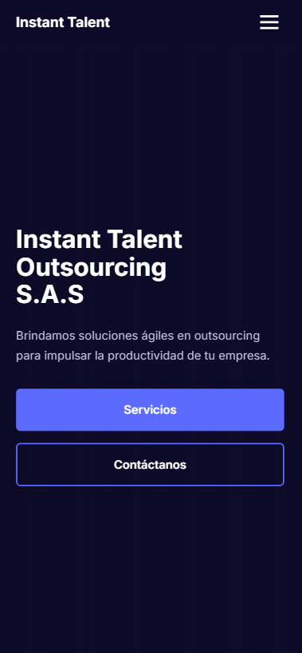

# Instant Talent Outsourcing S.A.S

## Descripción General

**Instant Talent Outsourcing S.A.S** es un proyecto frontend desarrollado con fines educativos que simula el sitio web corporativo de una empresa ficticia dedicada a la conexión de organizaciones con talento humano. El proyecto presenta una landing page completa con información institucional, servicios, equipo de trabajo, valores corporativos, políticas, estrategias y secciones de contacto, todo construido con HTML5, CSS3 y JavaScript Vanilla.

## Objetivos de Aprendizaje

Este proyecto fue desarrollado para fortalecer habilidades en:

- Maquetación web semántica y accesible.
- Implementación de diseño responsive mediante **Media Queries**, **Flexbox** y **CSS Grid**.
- Creación de un menú móvil (hamburguesa) con JavaScript puro, gestionando estados ARIA y eventos táctiles/teclado.
- Aplicación de animaciones CSS suaves y transiciones para mejorar la experiencia de usuario.
- Estructuración clara de código CSS con variables globales y sistema de espaciado.
- Implementación de scroll suave para navegación interna.
- Respeto por las preferencias de accesibilidad (`prefers-reduced-motion`).

## Contexto del Proyecto

La empresa ficticia **Instant Talent Outsourcing S.A.S** ofrece servicios de:

- Reclutamiento y Selección de personal.
- Capacitación y Desarrollo del talento.
- Outsourcing de personal operativo.

El sitio web incluye información sobre la visión, misión, valores, objetivos estratégicos, políticas corporativas, beneficios, proceso de trabajo y el equipo fundador. Su propósito es simular una presencia digital profesional para una organización de gestión humana.

## Tecnologías Utilizadas

| Tecnología      | Descripción                                      |
|----------------|--------------------------------------------------|
| HTML5           | Estructura semántica del documento y contenido. |
| CSS3            | Estilos, animaciones, sistema responsive (Grid, Flexbox, Media Queries). |
| JavaScript (Vanilla) | Interactividad: menú hamburguesa, smooth scroll, tracking de CTA, manejo de eventos. |
| Google Fonts    | Fuente tipográfica "Inter".                     |
| SVG (inline)    | Iconos de redes sociales en el footer.          |

## Características Principales

- **Diseño completamente responsive** que se adapta a móviles, tablets y escritorio.
- **Menú de navegación adaptativo** con botón hamburguesa en dispositivos móviles.
- **Hero section** con efecto parallax mediante CSS (`background-attachment: fixed`) y degradado de superposición.
- **Animaciones CSS** sutiles en títulos, cards, iconos y botones.
- **Secciones modulares** organizadas con grid y flexbox: servicios, valores, objetivos, políticas, estrategias, equipo.
- **Footers con enlaces a redes sociales** (iconos SVG interactivos).
- **Accesibilidad**: atributos ARIA, `prefers-reduced-motion`, skip-link, foco visible, etiquetas semánticas.
- **Simulación de tracking de CTA** a través de `console.log` para futura integración analítica.

## Estructura del Proyecto

```
/
├── index.html              # Documento principal HTML
├── main.js                 # Lógica JavaScript (menú, scroll, CTA)
├── style.css               # Estilos completos del proyecto
├── img/                    # Carpeta de imágenes propias
│   ├── 01-instant-talent.png    # Logo principal
│   └── 02-politicas.png         # Imagen de sección políticas
└── README.md               # Este archivo
```

> Nota: Las rutas de imágenes en el código apuntan a `assets/hero.jpg` y `assets/favicon.png`, mientras que otras imágenes están en `img/`. En un despliegue real se deben verificar dichos recursos.

## Diseño Responsive

El sitio implementa tres puntos de ruptura principales mediante **Media Queries** en `style.css`:

| Punto de ruptura | Tamaño mínimo | Cambios destacados                               |
|-----------------|---------------|--------------------------------------------------|
| **Móvil**       | Hasta 480px   | Menú hamburguesa, columnas en 1fr, texto centrado. |
| **Tablet**      | 481px - 768px | Hero CTA en fila, grid de equipo a 2 columnas, servicios a 2 columnas. |
| **Escritorio**  | 769px+        | Hero en 2 columnas, navegación horizontal visible, menú hamburguesa oculto. |
| **Escritorio grande** | 1024px+ | Primera tarjeta del equipo ocupa 2 columnas, márgenes más amplios. |

Además se utiliza `clamp()` para tipografía fluida y `grid-template-columns` con `repeat(auto-fit, minmax(...))` para adaptabilidad en secciones como `servicios`.

## Funcionalidades Implementadas

### JavaScript (`main.js`)

1. **Menú hamburguesa móvil**
   - Apertura/cierre con botón.
   - Cierre automático al hacer clic en un enlace.
   - Cierre con tecla `Escape`.
   - Cierre al hacer clic fuera del menú.
   - Bloqueo del scroll del body cuando el menú está abierto.
   - Gestión de atributos ARIA (`aria-expanded`, `aria-hidden`).

2. **Smooth Scroll**
   - Desplazamiento suave a secciones internas al hacer clic en enlaces `#`.
   - Respeta la preferencia `prefers-reduced-motion` (si el usuario pide movimiento reducido, el scroll es instantáneo).

3. **Tracking de CTAs**
   - Detecta clics en botones con atributo `data-cta`.
   - Registra en consola el nombre del CTA y la marca de tiempo.
   - (Simulación, pendiente de integración real con herramientas analíticas).

4. **Preferencias de movimiento reducido**
   - Deshabilita efectos de parallax y animaciones CSS cuando `prefers-reduced-motion` está activo.
   - Recarga la página al cambiar esta preferencia para aplicar los estilos correctos.

5. **Manejo de resize**
   - Cierra el menú móvil automáticamente si la ventana se redimensiona a tamaño desktop.

### CSS

- Sistema de variables CSS (colores, espaciados, transiciones).
- Efectos hover en tarjetas con `box-shadow` y `border-color`.
- Animaciones personalizadas: `talentoBounce`, `tituloGlow`, `textoMorado`, `knightGlow`, `gearSpin`, entre otras.
- Parallax CSS nativo en el hero (solo desktop).
- Estilos accesibles: `:focus` visible, `outline`, `skip-link`.

## Organización del Código

### HTML (`index.html`)

- Etiquetas semánticas: `header`, `nav`, `main` (implícito), `section`, `footer`, `article`.
- Uso de `role`, `aria-label` y `aria-hidden` para mejorar accesibilidad.
- Estructura ordenada con comentarios que delimitan cada sección.

### CSS (`style.css`)

- Comentarios claros por sección (ej: `/* ===== HERO SECTION ===== */`).
- Variables globales en `:root`.
- Metodología BEM parcial en algunos bloques (ej: `header__container`, `nav__list`).
- Media queries agrupadas al final del archivo.

### JavaScript (`main.js`)

- Código modular con funciones bien nombradas.
- Event listeners gestionados tras el `DOMContentLoaded`.
- Comentarios que explican cada bloque de funcionalidad.
- Manejo de errores silencioso con `console.warn`.

## Capturas o Vista Previa
 
>   
>   
>   
>   
>   
>   
> 

**Para visualizar el proyecto en línea:**  
[Demo en GitHub Pages](https://santiagoencodigo.github.io/desarrollo-web-profesional/projects/instant-talent-outsourcing/index.html)

## Posibles Mejoras Futuras

- **Formulario de contacto funcional:** actualmente no hay formulario, solo enlaces. Se podría agregar un formulario con validación y envío a servicio externo.
- **Integración real de analytics:** reemplazar los `console.log` por eventos de Google Analytics o Meta Pixel.
- **Optimización de imágenes:** implementar lazy loading y formatos modernos (WebP).
- **Mejora del parallax:** actualmente usa `background-attachment: fixed`, que puede tener problemas en algunos navegadores móviles. Se podría implementar con JavaScript.
- **Internacionalización:** agregar soporte para idioma inglés (i18n).
- **Backend básico:** simular envío de currículums o solicitudes de contacto.

## Aprendizajes Obtenidos

- **Diseño responsive avanzado:** comprensión profunda de cómo combinar Grid, Flexbox y media queries para lograr una experiencia consistente en todos los dispositivos.
- **Accesibilidad web:** implementación de atributos ARIA, manejo de foco, y respeto por `prefers-reduced-motion`.
- **JavaScript sin frameworks:** manipulación del DOM, gestión de eventos, control del scroll y animaciones controladas por código.
- **Organización de CSS:** uso de variables, nomenclatura consistente y separación de responsabilidades.
- **Simulación de empresa real:** creación de contenido coherente para una empresa ficticia, desde la misión hasta las políticas.

## Autor

**Santiago** (usuario GitHub: [santiagoencodigo](https://github.com/santiagoencodigo))

Proyecto desarrollado como práctica de desarrollo Frontend.

## Licencia

Este proyecto es de uso libre con fines educativos. No se otorga ninguna garantía. Puedes usarlo como base para tus propios aprendizajes.