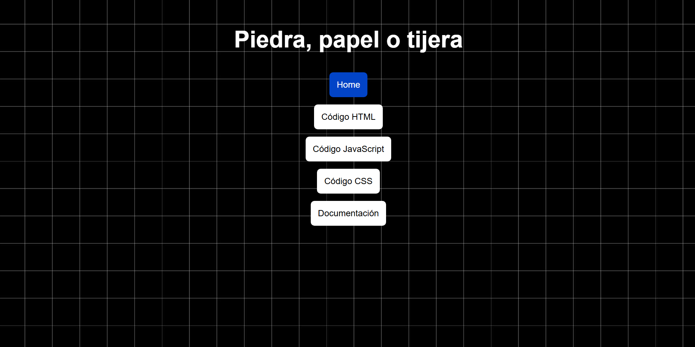
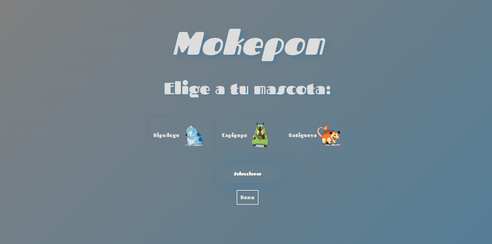

# Programación Básica

Este directorio reúne la documentación, proyectos y apuntes desarrollados durante el estudio de los fundamentos de la programación. Su propósito es documentar de forma estructurada el proceso de aprendizaje, desde los primeros conceptos de lógica de programación hasta la construcción de aplicaciones web interactivas utilizando **HTML**, **CSS** y **JavaScript**.

A lo largo de este módulo se desarrollan diferentes proyectos prácticos que permiten aplicar progresivamente los conocimientos adquiridos, fortaleciendo habilidades relacionadas con la resolución de problemas, la manipulación del DOM, el diseño de interfaces web y la organización del código.

La documentación de cada proyecto se encuentra organizada de manera independiente para facilitar su consulta y mantenimiento, permitiendo comprender la evolución de cada aplicación desde sus primeras versiones hasta implementaciones más completas y estructuradas.

---

## Contenido

Actualmente este módulo incluye los siguientes proyectos.

---

# Piedra, Papel o Tijera

Primer proyecto desarrollado durante el proceso de aprendizaje de Programación Básica.

Su objetivo principal es introducir los fundamentos de la programación mediante la construcción de un videojuego sencillo utilizando HTML, CSS y JavaScript.

Durante su desarrollo se estudian conceptos como:

- Variables
- Tipos de datos
- Operadores
- Condicionales
- Ciclos
- Funciones
- Generación de números aleatorios
- Manipulación básica del DOM
- Organización de archivos

## Proyecto

* [Proyecto](https://santiagoencodigo.github.io/desarrollo-web-profesional/projects/programacion-basica/piedra-papel-o-tijera/piedra-papel-o-tijera.html "Proyecto - Piedra Papel o Tijera")

* [Código HTML](https://github.com/santiagoencodigo/desarrollo-web-profesional/blob/main/projects/programacion-basica/piedra-papel-o-tijera/piedra-papel-o-tijera.html "Código HTML - Piedra Papel o Tijera")

* [Código CSS](https://github.com/santiagoencodigo/desarrollo-web-profesional/blob/main/projects/programacion-basica/piedra-papel-o-tijera/piedra-papel-o-tijera.css "Código CSS - Piedra Papel o Tijera")

* [Código JavaScript](https://github.com/santiagoencodigo/desarrollo-web-profesional/blob/main/projects/programacion-basica/piedra-papel-o-tijera/piedra-papel-o-tijera.js "Código JavaScript - Piedra Papel o Tijera")



---

# Mokepon

Proyecto que amplía los conocimientos adquiridos en el videojuego anterior mediante el desarrollo de una aplicación web más completa e interactiva.

Durante su construcción se implementan conceptos como:

- Manipulación avanzada del DOM
- Eventos
- Objetos y clases
- Programación Orientada a Objetos
- Arrays
- Renderizado dinámico
- Diseño Responsive
- Flexbox
- CSS Grid
- Refactorización y optimización del código

Además del proyecto principal, Mokepon cuenta con una documentación técnica independiente organizada dentro de la carpeta **docs/**, donde se explica detalladamente cada etapa de su desarrollo.

## Proyecto

* [Proyecto](https://santiagoencodigo.github.io/desarrollo-web-profesional/projects/programacion-basica/mokepon/mokepon.html "Mokepon - Demo en vivo by Santiagoencodigo")

* [Código HTML](https://github.com/santiagoencodigo/desarrollo-web-profesional/blob/main/projects/programacion-basica/mokepon/mokepon.html)

* [Código CSS](https://github.com/santiagoencodigo/desarrollo-web-profesional/blob/main/projects/programacion-basica/mokepon/mokepon.css)

* [Código JavaScript](https://github.com/santiagoencodigo/desarrollo-web-profesional/blob/main/projects/programacion-basica/mokepon/mokepon.js)



---

## Estructura del Directorio

```text
programacion-basica/
│
├── piedra-papel-o-tijera/
│   ├── piedra-papel-o-tijera.html
│   ├── piedra-papel-o-tijera.css
│   ├── piedra-papel-o-tijera.js
│   └── README.md
│
├── mokepon/
│   ├── docs/
│   ├── img/
│   ├── mokepon.html
│   ├── mokepon.css
│   ├── mokepon.js
│   └── README.md
│
└── README.md
```

---

## Tecnologías Utilizadas

- HTML5
- CSS3
- JavaScript (ES6+)

---

## Objetivos de Aprendizaje

Los proyectos desarrollados en este módulo buscan fortalecer competencias relacionadas con:

- Pensamiento lógico y algorítmico.
- Resolución de problemas mediante programación.
- Desarrollo de aplicaciones web interactivas.
- Organización y estructuración del código.
- Implementación de buenas prácticas de desarrollo.
- Documentación técnica de proyectos.

---

## Lecturas Recomendadas

- [Curso de Programación Básica - Platzi](https://platzi.com/cursos/programacion-basica/)
- [¿Qué es Programación? - freeCodeCamp](https://www.freecodecamp.org/espanol/news/que-es-programacion-manual-para-principiantes/)
- [Programación - Wikipedia](https://es.wikipedia.org/wiki/Programaci%C3%B3n)
- [HTML - MDN Web Docs](https://developer.mozilla.org/es/docs/Web/HTML)
- [CSS - MDN Web Docs](https://developer.mozilla.org/es/docs/Web/CSS)
- [JavaScript - MDN Web Docs](https://developer.mozilla.org/es/docs/Web/JavaScript)

---

Este módulo constituye la base sobre la cual se desarrollan los contenidos posteriores del repositorio **Desarrollo Web Profesional**, proporcionando los conocimientos fundamentales necesarios para abordar tecnologías y proyectos de mayor complejidad.