<div style="text-align:center;"><h1 id="main-title">Desarrollo Web Profesional</h1></div>

**Acceso directo:**  
[Página principal del proyecto](https://santiagoencodigo.github.io/desarrollo-web-profesional/)  
[Mapa neuronal interactivo](https://santiagoencodigo.github.io/desarrollo-web-profesional/sitemap.html)

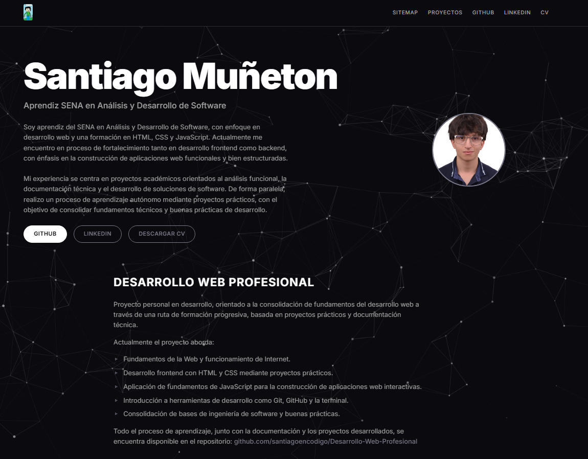

---

## Resumen

Este repositorio documenta y aplica mi proceso de aprendizaje en desarrollo web profesional.  
Contiene apuntes estructurados, proyectos prácticos y una red de conocimiento que conecta cada concepto con su implementación real.  
El objetivo es consolidar fundamentos sólidos en HTML, CSS, JavaScript, control de versiones, terminal y buenas prácticas de ingeniería de software, y crear una base reutilizable para proyectos futuros.

---

## Red de Conocimiento

Una de las piezas centrales de este repositorio es el [mapa neuronal](https://santiagoencodigo.github.io/desarrollo-web-profesional/sitemap.html), una visualización en grafo inspirada en la estética de Obsidian.  
Construido con D3.js y partículas animadas, este mapa conecta todos los proyectos, documentación y recursos del repositorio, mostrando las relaciones temáticas y secuenciales entre los distintos módulos.

**Interacciones disponibles:**
- Pasar el cursor sobre un nodo para ver una tarjeta con descripción y enlaces.
- Hacer clic para abrir el proyecto o la documentación correspondiente.
- Arrastrar nodos para reorganizar la red.
- Usar la rueda del ratón para hacer zoom.
- Botón "Centrar vista" para restaurar la posición inicial.

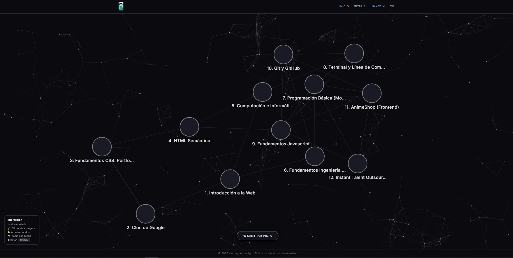

---

## Estructura del repositorio

```
Desarrollo-Web-Profesional/
├── assets/               # Recursos estáticos (imágenes, CSS, JS, PDF, media)
│   ├── css/              # Estilos (style.css, sitemap.css)
│   ├── img/              # Imágenes organizadas por categoría
│   │   ├── animeshop/    # Capturas de AnimeShop
│   │   ├── icons/        # Iconos, logos y foto de perfil
│   │   ├── instant-talent/ # Capturas de Instant Talent
│   │   └── proyectos/    # Capturas de todos los proyectos y documentación
│   ├── js/               # main.js (lógica del mapa neuronal)
│   ├── media/            # Audio y vídeo
│   └── pdf/              # CV y proximamente otros documentos descargables
├── docs/                 # Documentación en Markdown de conocimientos teóricos.
├── projects/             # Proyectos prácticos (cada uno con su propio HTML/CSS/JS y README)
│   ├── animeshop/
│   ├── fundamentos-html/
│   ├── fundamentos-js/
│   ├── google-clone/
│   ├── instant-talent-outsourcing/
│   ├── portfolio/
│   └── programacion-basica/
├── index.html            # Página principal (portafolio y lista de proyectos)
├── sitemap.html          # Mapa neuronal interactivo (grafo de conocimiento)
└── README.md             # Este archivo
```

---

## Tecnologías y herramientas

- **HTML5** y **CSS3** (Flexbox, Grid, variables CSS, metodología BEM)
- **JavaScript** (Vanilla, manipulación del DOM, eventos)
- **Bootstrap 5** (utilidades y componentes en proyectos frontend)
- **D3.js** (visualización del grafo de conocimiento)
- **Particles.js** (fondo animado en la página principal y en el mapa)
- **Git** y **GitHub** (control de versiones y despliegue)
- **Terminal (BASH)** (comandos básicos y flujo de trabajo)
- **Google Fonts** (tipografía Inter)

---

## Instalación y uso local

Para ejecutar este proyecto en tu entorno local:

1. Clona el repositorio:
   ```bash
   git clone https://github.com/santiagoencodigo/desarrollo-web-profesional.git
   ```
2. Navega a la carpeta del proyecto:
   ```bash
   cd desarrollo-web-profesional
   ```
3. Abre el archivo `index.html` en tu navegador preferido (no se necesita servidor adicional, ya que es estático).

También puedes explorar el mapa neuronal abriendo `sitemap.html` directamente.

---

## Tabla de contenidos

- [Historia y funcionamiento de Internet](#historia-y-funcionamiento-de-internet)
- [HTML y CSS práctico: Clon de Google](#html-y-css-practico-clon-de-google)
- [Fundamentos de CSS](#fundamentos-de-css)
- [HyperText Markup Language (HTML)](#hypertext-markup-language-html)
- [Computadores e informática básica](#computadores-e-informatica-basica)
- [Fundamentos de ingeniería de software](#fundamentos-de-ingenieria-de-software)
- [Programación básica (Mokepon)](#programacion-basica-mokepon)
- [Terminal y línea de comandos](#terminal-y-linea-de-comandos)
- [Fundamentos de JavaScript](#fundamentos-de-javascript)
- [Control de versiones con Git y GitHub](#control-de-versiones-con-git-y-github)
- [Frontend: AnimeShop](#frontend-animeshop)
- [Frontend: Instant Talent Outsourcing](#frontend-instant-talent-outsourcing)

---

## Módulos de aprendizaje

### Historia y funcionamiento de Internet

- [Documentación](https://github.com/santiagoencodigo/desarrollo-web-profesional/blob/main/docs/1-introduccion-a-la-web-historia-y-funcionamiento-de-internet.md)

Apuntes sobre bits, bytes, código máquina, ASCII, RGB, Unicode, ARPANET, protocolos HTTP/HTTPS, navegadores, W3C y evolución de la World Wide Web.

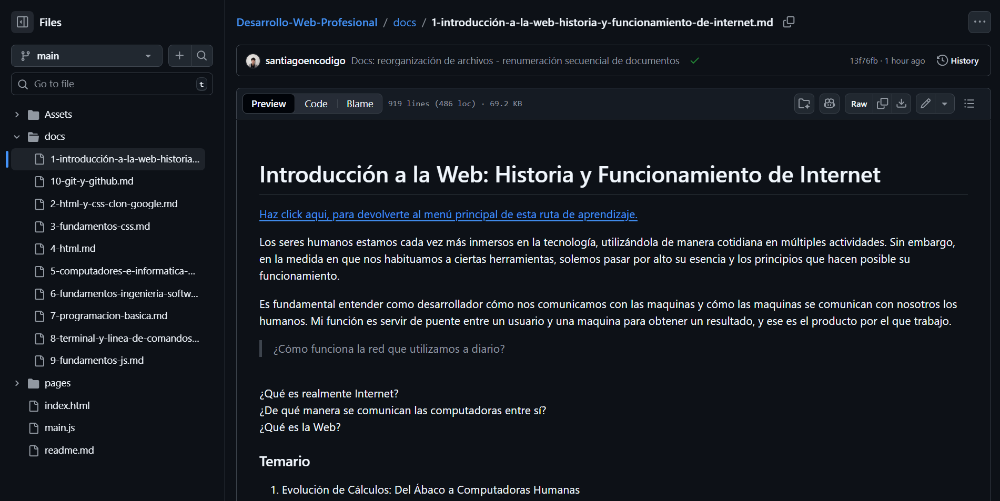

---

### HTML y CSS práctico: Clon de Google

- [Documentación](https://github.com/santiagoencodigo/desarrollo-web-profesional/blob/main/docs/2-html-y-css-clon-google.md)
- [Proyecto en vivo](https://santiagoencodigo.github.io/desarrollo-web-profesional/projects/google-clone/index.html)

Clon de la página principal de Google desarrollado con HTML5 y CSS3.  
Práctica de estructura semántica, Flexbox, Grid, metodología BEM y uso de DevTools.


---

### Fundamentos de CSS

- [Documentación](https://github.com/santiagoencodigo/desarrollo-web-profesional/blob/main/docs/3-fundamentos-css.md)
- [Proyecto en vivo](https://santiagoencodigo.github.io/desarrollo-web-profesional/projects/portfolio/index.html)

Exploración de tipografía, colores, layouts responsivos, animaciones y efectos visuales para construir interfaces atractivas y funcionales.

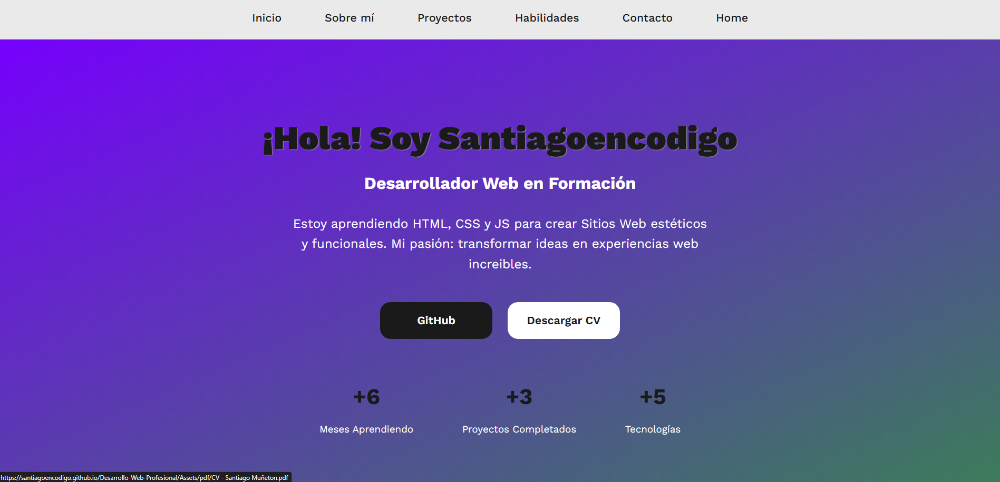

---

### HyperText Markup Language (HTML)

- [Documentación](https://github.com/santiagoencodigo/desarrollo-web-profesional/blob/main/docs/4-html.md)
- [Proyecto en vivo](https://santiagoencodigo.github.io/desarrollo-web-profesional/projects/fundamentos-html/index.html)

Apuntes sobre HTML semántico, accesibilidad, SEO y buenas prácticas de estructuración.


---

### Computadores e informática básica

- [Documentación](https://github.com/santiagoencodigo/desarrollo-web-profesional/blob/main/docs/5-computadores-e-informatica-basica.md)

Conceptos básicos de computación: funcionamiento de una computadora, instalación de software, navegación segura, gestión de archivos y ciberseguridad esencial.

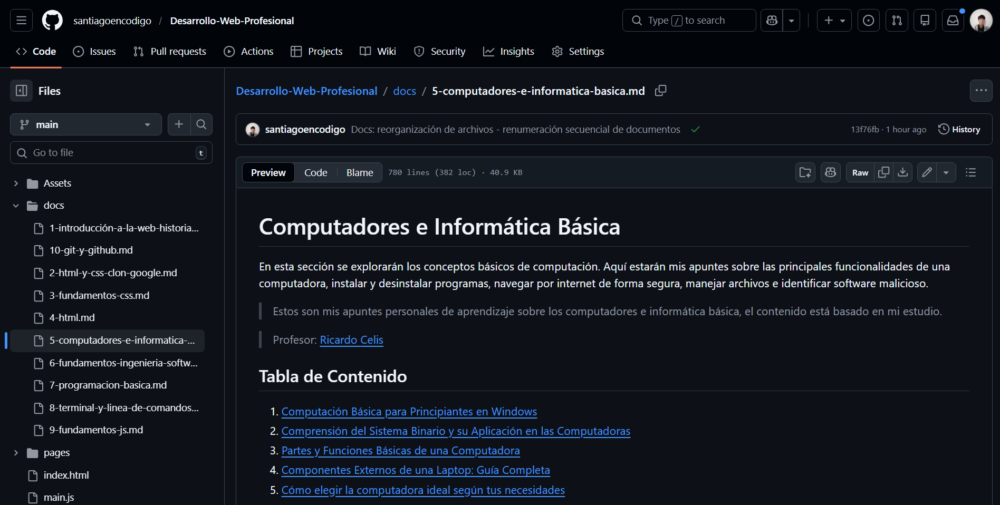

---

### Fundamentos de ingeniería de software

- [Documentación](https://github.com/santiagoencodigo/desarrollo-web-profesional/blob/main/docs/6-fundamentos-ingenieria-software.md)

Recopilación de conceptos clave: bits, bytes, internet, chips, IA, sistemas y arquitectura de software.

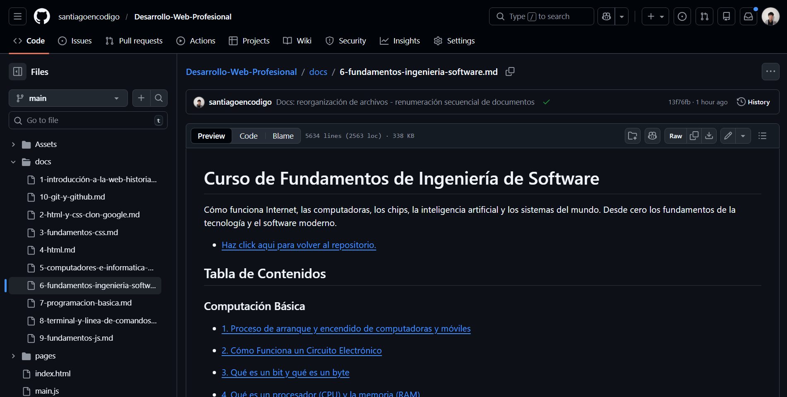

---

### Programación básica (Mokepon)

- [Documentación](https://github.com/santiagoencodigo/desarrollo-web-profesional/blob/main/projects/programacion-basica)
- [Proyecto en vivo](https://santiagoencodigo.github.io/desarrollo-web-profesional/projects/programacion-basica/mokepon/mokepon.html)

Videojuego estilo piedra-papel-tijera con temática de mascotas. Desarrollado con JavaScript, HTML y CSS para consolidar lógica de programación, manipulación del DOM y eventos.


*Estado: en proceso de mejora continua.*

---

### Terminal y línea de comandos

- [Documentación](https://github.com/santiagoencodigo/desarrollo-web-profesional/blob/main/docs/8-terminal-y-linea-de-comandos.md)

Uso de la terminal (BASH) para navegación, manipulación de archivos, permisos, procesos, grep, curl y personalización del shell.

*Estado: en proceso.*

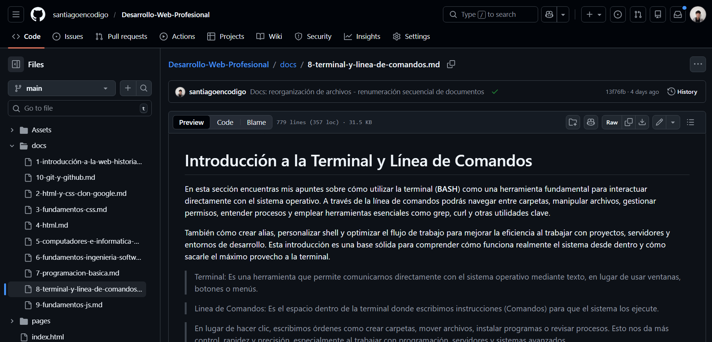

---

### Fundamentos de JavaScript

- [Documentación](https://github.com/santiagoencodigo/desarrollo-web-profesional/blob/main/docs/9-fundamentos-js.md) (pendiente)
- [Proyecto en vivo](https://santiagoencodigo.github.io/desarrollo-web-profesional/projects/fundamentos-js/index.html) (pendiente)

*Estado: próximamente.*

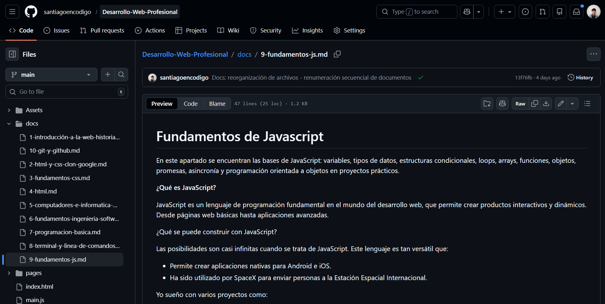

---

### Control de versiones con Git y GitHub

- [Documentación](https://github.com/santiagoencodigo/desarrollo-web-profesional/blob/main/docs/10-git-y-github.md) (pendiente)

*Estado: próximamente.*

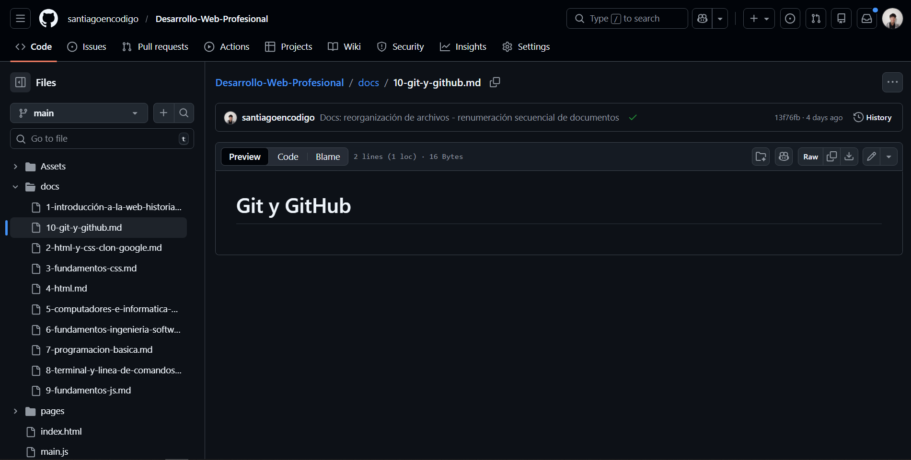

---

### Frontend: AnimeShop

- [Repositorio](https://github.com/santiagoencodigo/desarrollo-web-profesional/tree/main/projects/animeshop)
- [Demo en vivo](https://santiagoencodigo.github.io/desarrollo-web-profesional/projects/animeshop/index.html)

Landing page temática de anime (One Piece y Naruto) con HTML semántico, CSS moderno, Bootstrap 5 y JavaScript Vanilla.  
Incluye hero animado, catálogo dinámico, carruseles, filtros y carrito de compras funcional.

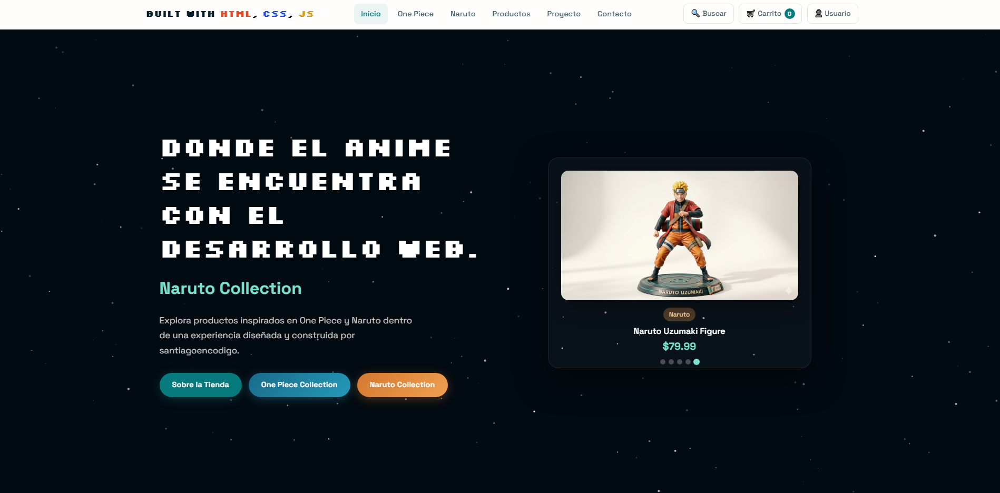
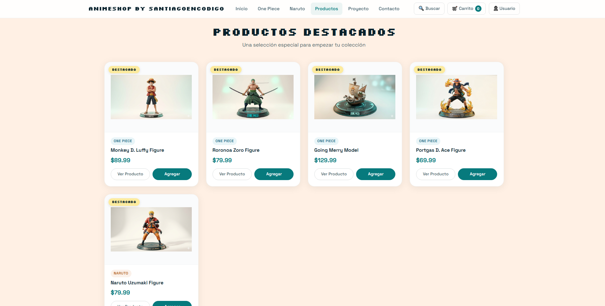


---

### Frontend: Instant Talent Outsourcing

- [Repositorio](https://github.com/santiagoencodigo/desarrollo-web-profesional/tree/main/projects/instant-talent-outsourcing)
- [Demo en vivo](https://santiagoencodigo.github.io/desarrollo-web-profesional/projects/instant-talent-outsourcing/index.html)

Sitio corporativo para una empresa ficticia de outsourcing y gestión del talento humano.  
Desarrollado con HTML semántico, CSS (Grid, Flexbox, variables) y JavaScript Vanilla.  
Incluye menú hamburguesa, efectos parallax, animaciones y secciones completas (servicios, valores, políticas, equipo directivo). Totalmente responsive.


---

> Este repositorio se encuentra en desarrollo activo.

## Contribuciones y contacto

Este es un proyecto personal de aprendizaje, pero las sugerencias y comentarios son bienvenidos.  
Puedes abrir un issue en el repositorio o contactarme a través de:

- [GitHub](https://github.com/santiagoencodigo)
- [LinkedIn](https://www.linkedin.com/in/santiago-muñeton-hernandez/)

---

<p align="center">Hecho por Santiago Muñeton · <a href="https://santiagoencodigo.github.io/desarrollo-web-profesional/">Visita la web</a></p>