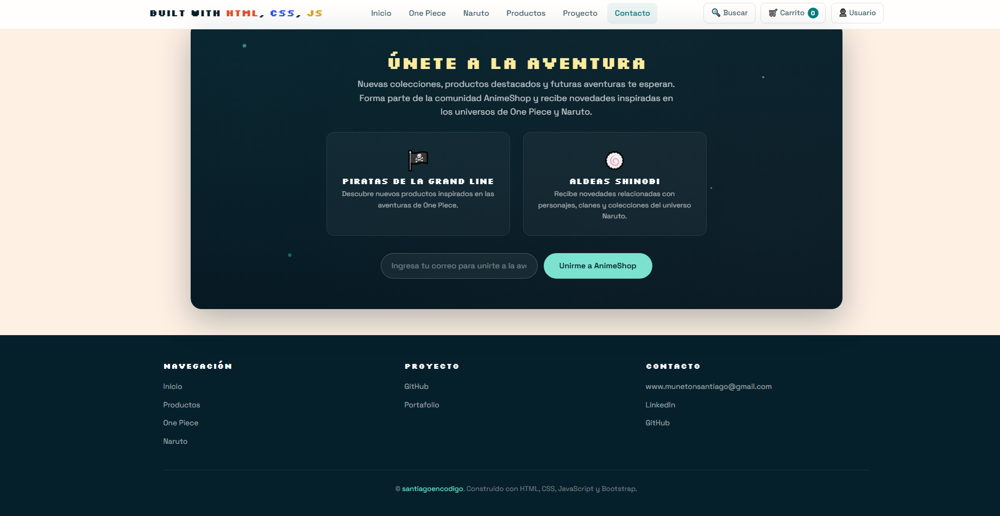

<div style="text-align:center;"><h1 id="main-title">Desarrollo Web Profesional</h1></div>

**Acceso directo:**  
[Pagina principal del proyecto](https://santiagoencodigo.github.io/desarrollo-web-profesional/)  
[Mapa neuronal interactivo](https://santiagoencodigo.github.io/desarrollo-web-profesional/sitemap.html)


---

## Resumen

Este repositorio documenta y aplica mi proceso de aprendizaje en desarrollo web profesional.  
Contiene apuntes estructurados, proyectos prácticos y una red de conocimiento que conecta cada concepto con su implementación real.  
El objetivo es consolidar fundamentos sólidos en HTML, CSS, JavaScript, control de versiones, terminal y buenas prácticas de ingeniería de software, y crear una base reutilizable para proyectos futuros.

---

## Red de Conocimiento

Una de las piezas centrales de este repositorio es el [mapa neuronal](https://santiagoencodigo.github.io/desarrollo-web-profesional/sitemap.html), una visualización en grafo inspirada en la estética de Obsidian.  
Construido con D3.js y partículas animadas, este mapa conecta todos los proyectos, documentación y recursos del repositorio, mostrando las relaciones temáticas y secuenciales entre los distintos módulos.

**Interacciones disponibles:**
- Pasar el cursor sobre un nodo para ver una tarjeta con descripción y enlaces.
- Hacer clic para abrir el proyecto o la documentación correspondiente.
- Arrastrar nodos para reorganizar la red.
- Usar la rueda del ratón para hacer zoom.
- Boton "Centrar vista" para restaurar la posicion inicial.


---

## Estructura del repositorio

```
Desarrollo-Web-Profesional/
├── Assets/               # Imágenes, PDFs y recursos estáticos
├── docs/                 # Documentación en Markdown de cada módulo
├── pages/                # Proyectos prácticos (Google Clone, Portfolio, etc.)
├── frontend/             # Proyectos frontend completos (AnimeShop, Instant Talent)
├── index.html            # Página principal (portafolio y lista de proyectos)
├── sitemap.html          # Mapa neuronal interactivo (grafo de conocimiento)
├── main.js               # Lógica del mapa neuronal (D3.js)
├── Assets/sitemap.css    # Estilos del mapa neuronal
└── README.md             # Este archivo
```

---

## Tecnologías y herramientas

- **HTML5** y **CSS3** (Flexbox, Grid, variables CSS, metodología BEM)
- **JavaScript** (Vanilla, manipulación del DOM, eventos)
- **Bootstrap 5** (utilidades y componentes en proyectos frontend)
- **D3.js** (visualización del grafo de conocimiento)
- **Particles.js** (fondo animado en la página principal y en el mapa)
- **Git** y **GitHub** (control de versiones y despliegue)
- **Terminal (BASH)** (comandos básicos y flujo de trabajo)
- **Google Fonts** (tipografía Inter)

---

## Instalación y uso local

Para ejecutar este proyecto en tu entorno local:

1. Clona el repositorio:
   ```bash
   git clone https://github.com/santiagoencodigo/desarrollo-web-profesional.git
   ```
2. Navega a la carpeta del proyecto:
   ```bash
   cd desarrollo-web-profesional
   ```
3. Abre el archivo `index.html` en tu navegador preferido (no se necesita servidor adicional, ya que es estático).

También puedes explorar el mapa neuronal abriendo `sitemap.html` directamente.

---

## Tabla de contenidos

- [Historia y funcionamiento de Internet](#historia-y-funcionamiento-de-internet)
- [HTML y CSS práctico: Clon de Google](#html-y-css-practico-clon-de-google)
- [Fundamentos de CSS](#fundamentos-de-css)
- [HyperText Markup Language (HTML)](#hypertext-markup-language-html)
- [Computadores e informática básica](#computadores-e-informatica-basica)
- [Fundamentos de ingeniería de software](#fundamentos-de-ingenieria-de-software)
- [Programación básica (Mokepon)](#programacion-basica-mokepon)
- [Terminal y línea de comandos](#terminal-y-linea-de-comandos)
- [Fundamentos de JavaScript](#fundamentos-de-javascript)
- [Control de versiones con Git y GitHub](#control-de-versiones-con-git-y-github)
- [Frontend: AnimeShop](#frontend-animeshop)
- [Frontend: Instant Talent Outsourcing](#frontend-instant-talent-outsourcing)

---

## Modulos de aprendizaje

### Historia y funcionamiento de Internet

- [Documentacion](https://github.com/santiagoencodigo/desarrollo-web-profesional/blob/main/docs/1-introduccion-a-la-web-historia-y-funcionamiento-de-internet.md)

Apuntes sobre bits, bytes, codigo maquina, ASCII, RGB, Unicode, ARPANET, protocolos HTTP/HTTPS, navegadores, W3C y evolucion de la World Wide Web.


---

### HTML y CSS practico: Clon de Google

- [Documentacion](https://github.com/santiagoencodigo/desarrollo-web-profesional/blob/main/docs/2-html-y-css-clon-google.md)
- [Proyecto en vivo](https://santiagoencodigo.github.io/desarrollo-web-profesional/pages/01-html-y-css-google-clone/index.html)

Clon de la pagina principal de Google desarrollado con HTML5 y CSS3.  
Practica de estructura semantica, Flexbox, Grid, metodologia BEM y uso de DevTools.


---

### Fundamentos de CSS

- [Documentacion](https://github.com/santiagoencodigo/desarrollo-web-profesional/blob/main/docs/3-fundamentos-css.md)
- [Proyecto en vivo](https://santiagoencodigo.github.io/desarrollo-web-profesional/pages/02-fundamentos-css/index.html)

Exploracion de tipografia, colores, layouts responsivos, animaciones y efectos visuales para construir interfaces atractivas y funcionales.


---

### HyperText Markup Language (HTML)

- [Documentacion](https://github.com/santiagoencodigo/desarrollo-web-profesional/blob/main/docs/4-html.md)
- [Proyecto en vivo](https://santiagoencodigo.github.io/desarrollo-web-profesional/pages/03-html/index.html)

Apuntes sobre HTML semantico, accesibilidad, SEO y buenas practicas de estructuración.


---

### Computadores e informatica basica

- [Documentacion](https://github.com/santiagoencodigo/desarrollo-web-profesional/blob/main/docs/5-computadores-e-informatica-basica.md)

Conceptos basicos de computacion: funcionamiento de una computadora, instalacion de software, navegacion segura, gestion de archivos y ciberseguridad esencial.


---

### Fundamentos de ingenieria de software

- [Documentacion](https://github.com/santiagoencodigo/desarrollo-web-profesional/blob/main/docs/6-fundamentos-ingenieria-software.md)

Recopilacion de conceptos clave: bits, bytes, internet, chips, IA, sistemas y arquitectura de software.


---

### Programacion basica (Mokepon)

- [Documentacion](https://github.com/santiagoencodigo/desarrollo-web-profesional/blob/main/docs/7-programacion-basica.md)
- [Proyecto en vivo](https://santiagoencodigo.github.io/desarrollo-web-profesional/pages/04-programacion-basica/02-mokepon/mokepon.html)

Videojuego estilo piedra-papel-tijera con tematica de mascotas. Desarrollado con JavaScript, HTML y CSS para consolidar logica de programacion, manipulacion del DOM y eventos.


*Estado: en proceso de mejora continua.*

---

### Terminal y linea de comandos

- [Documentacion](https://github.com/santiagoencodigo/desarrollo-web-profesional/blob/main/docs/8-terminal-y-linea-de-comandos.md)

Uso de la terminal (BASH) para navegacion, manipulacion de archivos, permisos, procesos, grep, curl y personalizacion del shell.

*Estado: en proceso.*

---

### Fundamentos de JavaScript

- Documentacion (pendiente)
- Proyecto (pendiente)

*Estado: proximamente.*

---

### Control de versiones con Git y GitHub

- Documentacion (pendiente)

*Estado: proximamente.*

---

### Frontend: AnimeShop

- [Repositorio](https://github.com/santiagoencodigo/desarrollo-web-profesional/tree/main/frontend/AnimeShop)
- [Demo en vivo](https://santiagoencodigo.github.io/desarrollo-web-profesional/frontend/AnimeShop/index.html)

Landing page tematica de anime (One Piece y Naruto) con HTML semantico, CSS moderno, Bootstrap 5 y JavaScript Vanilla.  
Incluye hero animado, catalogo dinamico, carruseles, filtros y carrito de compras funcional.




---

### Frontend: Instant Talent Outsourcing

- [Repositorio](https://github.com/santiagoencodigo/desarrollo-web-profesional/tree/main/frontend/Instant-Talent-Outsourcing)
- [Demo en vivo](https://santiagoencodigo.github.io/desarrollo-web-profesional/frontend/Instant-Talent-Outsourcing/index.html)

Sitio corporativo para una empresa ficticia de outsourcing y gestion del talento humano.  
Desarrollado con HTML semantico, CSS (Grid, Flexbox, variables) y JavaScript Vanilla.  
Incluye menu hamburguesa, efectos parallax, animaciones y secciones completas (servicios, valores, politicas, equipo directivo). Totalmente responsive.


---

> Este repositorio se encuentra en desarrollo activo.

## Contribuciones y contacto

Este es un proyecto personal de aprendizaje, pero las sugerencias y comentarios son bienvenidos.  
Puedes abrir un issue en el repositorio o contactarme a traves de:

- [GitHub](https://github.com/santiagoencodigo)
- [LinkedIn](https://www.linkedin.com/in/santiago-muñeton-hernandez/)
---

<p align="center">Hecho por Santiago Muneton · <a href="https://santiagoencodigo.github.io/desarrollo-web-profesional/">Visita la web</a></p>